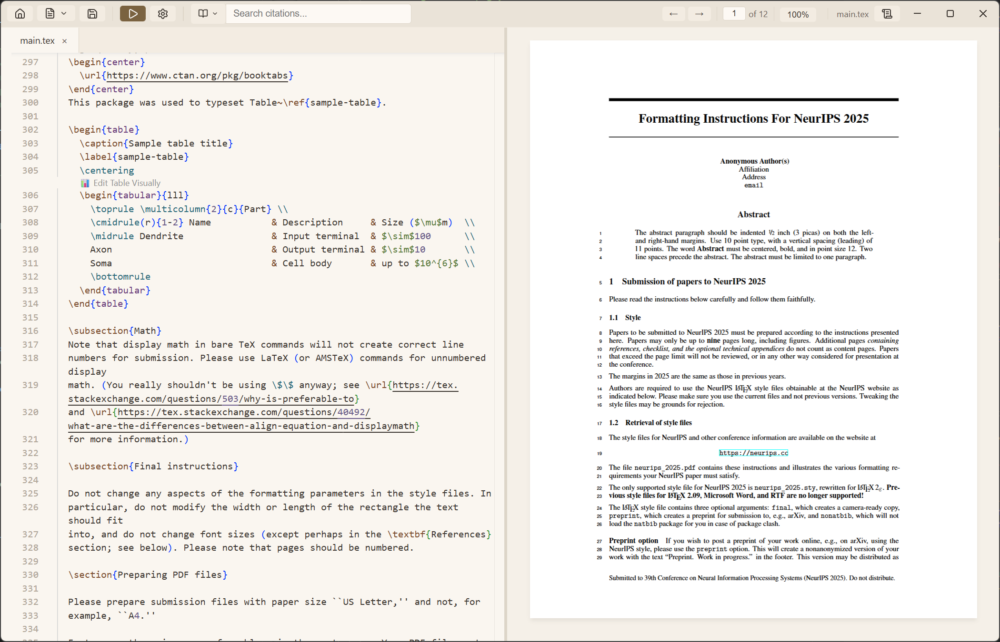
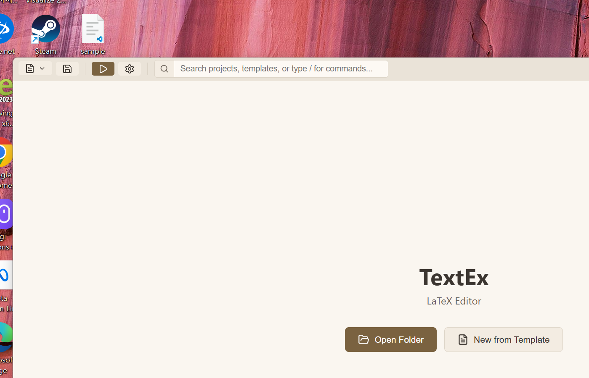
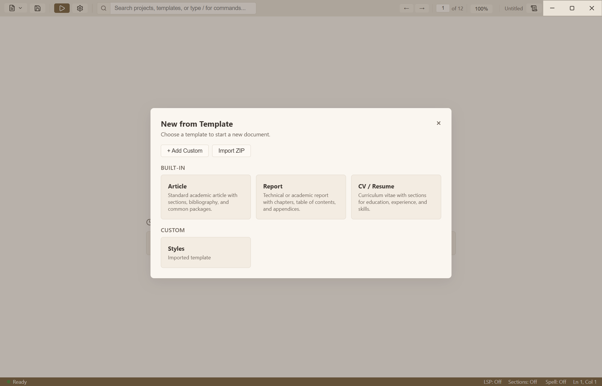
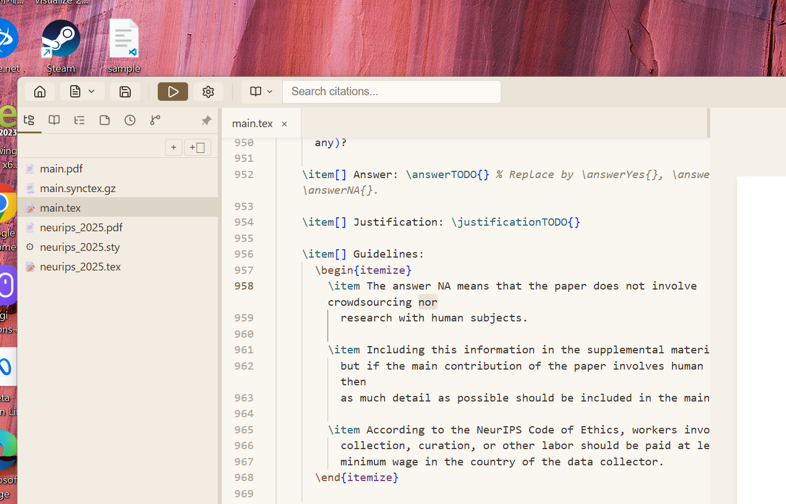
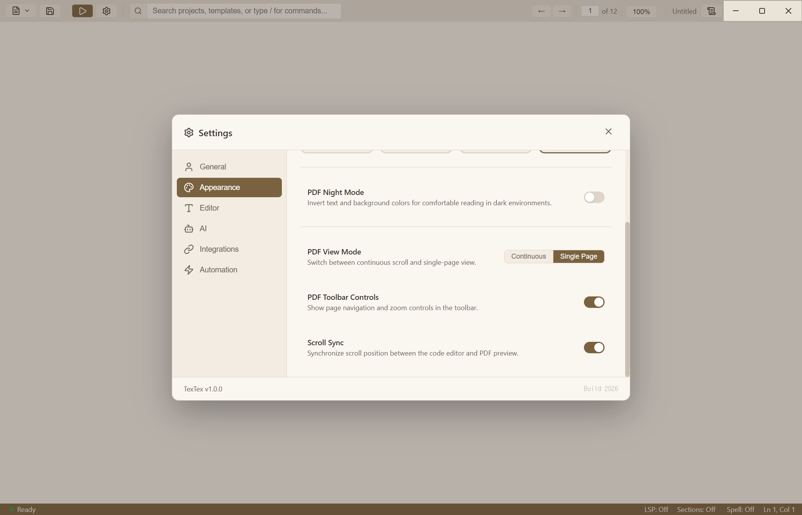
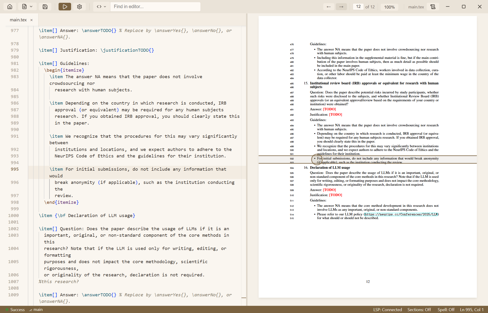
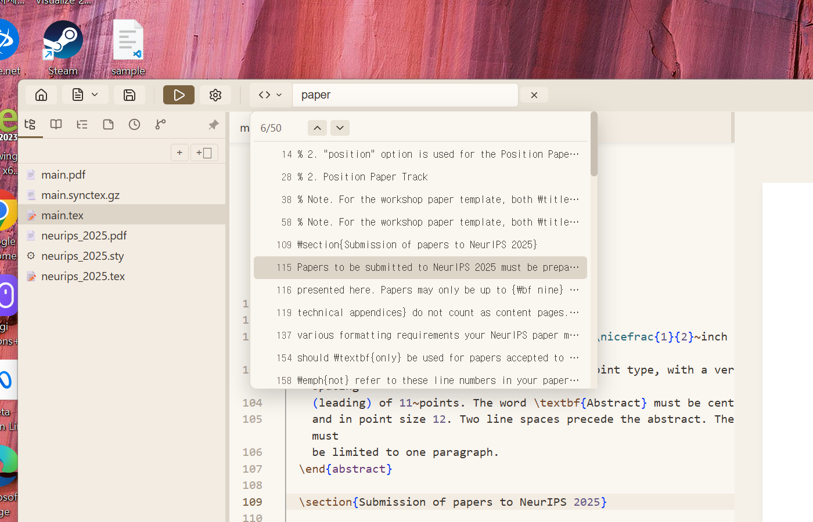

[**English**](README.md)

# TextEx

[](https://github.com/Topasm/textex/actions/workflows/build.yml)
[](https://github.com/Topasm/textex/releases/latest)

**무료**, **로컬 우선** Tauri 데스크톱 LaTeX 에디터입니다. TextEx는 계정이나 클라우드 서비스 없이 사용자의 컴퓨터에서 실행됩니다. 왼쪽에는 Monaco 코드 에디터, 오른쪽에는 실시간 PDF 미리보기를 제공하는 분할 화면 인터페이스를 갖추고 있으며, [Tectonic](https://tectonic-typesetting.github.io/) 엔진이 내장되어 있어 TeX Live나 MiKTeX 같은 별도의 TeX 배포판을 설치할 필요가 **없습니다**. 필요하면 설정에서 시스템 pdfLaTeX 설치를 선택해 `latexmk`를 통해 사용할 수도 있습니다. 지원 파일 seed가 비어 있는 빌드는 첫 컴파일에 네트워크를 사용할 수 있으며, 필요한 파일이 캐시된 뒤에는 오프라인 컴파일이 가능합니다.

<p align="center">
  
</p>

## 주요 기능

| 기능 | 설명 |
|------|------|
| **무료 & 로컬 우선** | 계정과 클라우드 없이 문서는 로컬에 보관되며, 최초 TeX 지원 파일은 다운로드될 수 있습니다 |
| **설치 불필요** | Tectonic 엔진 내장 — TeX 설치 불필요 |
| **실시간 PDF 미리보기** | 저장 시 자동 컴파일 및 분할 화면 미리보기 |
| **스크롤 동기화** | 에디터와 PDF 간 양방향 스크롤 동기화 |
| **SyncTeX** | Ctrl+클릭으로 소스 코드와 PDF 위치 간 이동 |
| **OmniSearch** | 인용, PDF 텍스트, 에디터 텍스트를 통합 검색 |
| **Monaco 에디터** | 구문 강조, 자동 완성, 스니펫, Vim 모드 |
| **멀티 파일 프로젝트** | 생성 파일을 기본으로 숨기는 사이드바 파일 트리, 탭 바, `\input`/`\include` 탐색 |
| **인용 관리** | BibTeX 자동 완성 + Zotero 연동 |
| **논문 제출 점검** | 인용 위치, 중복 경고, 결정론적인 제출 전 검사 |
| **연구 & AI** | Crossref/arXiv 검색 및 네이티브 HTTP, Claude Code, Codex CLI 도우미 |
| **언어 & 프로젝트 도구** | 내장 LaTeX 개요·완성·진단과 시스템 터미널에서 프로젝트 열기 |
| **Git 통합** | 내장 스테이징, 커밋, 브랜치 상태 및 확인 기반 Fetch/Pull/Push |
| **내보내기** | 깔끔한 Overleaf 소스 ZIP 생성 또는 Pandoc을 통한 DOCX, ODT, HTML, EPUB 변환 |
| **7개 언어** | EN, KO, ES, FR, DE, PT, ZH |

> **선택적 연동:** AI API 제공자와 온라인 논문 검색에는 네트워크가 필요합니다.
> Claude Code 및 Codex CLI 기능은 해당 실행 파일이 `PATH`에 있어야 하며,
> 핵심 편집기와 내장 Tectonic 컴파일러는 이들 없이도 로컬에서 동작합니다.

---

## 시작하기

<p align="center">
  
</p>

### 1. 다운로드 및 설치

[릴리스 페이지](https://github.com/Topasm/textex/releases/latest)에서 최신 버전을 다운로드하거나, [GitHub Actions](../../actions/workflows/build.yml)에서 개발 빌드를 받으세요.

| 플랫폼 | 파일 |
|----------|------|
| Windows x64 | `.exe` 설치 파일 |
| macOS Apple Silicon (arm64) | arm64 `.dmg` |
| Linux x64 | `.AppImage` 또는 `.deb` |

### 2. OS별 설정

**macOS:**
앱이 격리될 수 있습니다. 설치 후 다음 명령어를 실행하세요:
```bash
xattr -cr /Applications/TextEx.app
```
또는 앱을 우클릭 > **열기** > **열기**를 선택하세요.

macOS에서 주 창을 닫으면 다른 문서 앱처럼 프로세스를 종료하지 않고 창을 숨겨
현재 프로젝트를 유지합니다. Dock 아이콘을 누르면 다시 열리며, 앱을 완전히
종료하려면 **TextEx > TextEx 종료** 또는 `Cmd+Q`를 사용하세요.

**Linux:**
AppImage를 실행 가능하게 만드세요:
```bash
chmod +x TextEx_*.AppImage
./TextEx_*.AppImage
```

---

## 사용 가이드

### 새 프로젝트 만들기
- **폴더 열기**: 홈 화면의 **Open Folder**를 사용하여 프로젝트 디렉토리를 선택합니다.
- **가이드 데모 논문**: 인용, Research Chat, 제출 점검, 컴파일러 전환, Overleaf 내보내기를 순서대로 체험할 수 있는 컴파일 가능한 프로젝트를 만듭니다.
- **템플릿 사용**: **New from Template**을 사용하여 미리 구성된 LaTeX 템플릿(article, beamer, thesis, letter 등)으로 빠르게 시작하세요.

<p align="center">
  
</p>

### 멀티 파일 프로젝트

폴더를 열면 사이드바 파일 트리, 탭, `\input`/`\include` 탐색이 포함된 전체 프로젝트 뷰를 사용할 수 있습니다.
복원할 세션이 없으면 TextEx는 루트의 `main.tex`, 루트의 `root.tex`, 그 밖의
`.tex` 파일 순으로 안정적으로 기본 문서를 선택해 자동으로 엽니다.
컴파일 산출물은 소스 옆이 아니라 TextEx의 엔진별 캐시에 저장됩니다. 눈 모양
버튼으로 프로젝트에 남아 있는 기존 생성 파일을 표시하거나, 보관함 버튼으로
Overleaf 업로드용 소스 ZIP을 만들 수 있습니다.

<p align="center">
  
</p>

### 문서 작성하기
TextEx는 다음과 같은 기능을 갖춘 최신 Monaco 기반 에디터를 제공합니다:
- **구문 강조**: Monaco의 로컬 tokenizer를 사용한 LaTeX 구문 컬러링.
- **자동 완성**: 명령어, 환경, 라벨, 인용 키에 대한 지능형 제안.
- **스니펫**: 일반적인 패턴(예: `begin`, `figure`, `table`)을 빠르게 삽입.
- **수학 미리보기**: `$...$` 또는 `\[...\]` 내에서 입력하는 즉시 수식 렌더링.
- **섹션 하이라이트**: 거터에서 `\section` 제목에 대한 색상 코드 밴드.
- **시각적 표 에디터**: `tabular` 위의 CodeLens를 클릭하여 시각적 에디터 열기.

### 컴파일 및 미리보기
- **자동 컴파일**: 저장(`Ctrl+S`) 시 PDF 미리보기가 자동으로 업데이트됩니다.
- **수동 컴파일**: `Ctrl+Enter`를 눌러 언제든지 강제 컴파일할 수 있습니다.
- **PDF 보기 모드**: 설정 > 외관에서 연속 스크롤과 단일 페이지 보기 간 전환.

### 스크롤 동기화

<p align="center">
  
</p>

설정 > 외관에서 **스크롤 동기화**를 활성화하여 에디터와 PDF를 정렬하세요:
- **에디터**에서 스크롤하면 PDF가 해당 콘텐츠로 자동 스크롤됩니다.
- **PDF**에서 스크롤하면 에디터가 해당 소스 라인으로 자동 스크롤됩니다.
- 사전 계산된 SyncTeX 라인 맵을 사용하여 즉시 조회 (지연 없음).
- 내장 피드백 루프 방지 — 바운싱이나 떨림 없음.

### SyncTeX (클릭하여 이동)
- **코드 → PDF**: "Sync Code to PDF" 툴바 버튼을 클릭하여 PDF에서 현재 줄을 하이라이트.
- **PDF → 코드**: PDF 아무 곳에서나 `Ctrl+클릭`하여 해당 소스 라인으로 이동.

<p align="center">
  
</p>

### 이미지 삽입 (스마트 드롭)
- 컴퓨터에서 이미지 파일을 에디터로 직접 **드래그 앤 드롭**하세요.
- TextEx가 자동으로:
  1. 이미지를 프로젝트의 `images/` 폴더로 복사합니다.
  2. `\begin{figure} ... \end{figure}` 스니펫을 삽입합니다.

### 인용 관리
- **BibTeX 지원**: `.bib` 파일을 감지하고 `\cite{...}` 키를 자동 완성합니다.
- **인용 툴팁**: PDF 미리보기에서 인용 위에 마우스를 올리면 제목, 저자, 연도를 확인할 수 있습니다.
- **Zotero 연동**:
  1. Better BibTeX가 설치된 Zotero가 실행 중인지 확인하세요.
  2. 오른쪽 Research 패널의 **References**에서 프로젝트와 Zotero를 함께 검색합니다. 결과가 없으면 Crossref/arXiv 온라인 검색을 사용할 수 있습니다.
  3. 논문을 에디터로 드래그하거나 OmniSearch의 `/r`, `/z`, `/o`를 사용합니다.
  4. 온라인 검색 결과는 Zotero에 영구 저장하거나 프로젝트 참고문헌에 바로 추가할 수 있습니다.

### 생산성 도구

<p align="center">
  
</p>

- **OmniSearch**: 툴바 검색 필드에서 파일, 인용, PDF 텍스트, 명령어를 통합 검색.
- **할 일 패널**: 사이드바에서 집필 작업을 관리.
- **노트 패널**: 프로젝트 할 일과 메모를 함께 관리.
- **타임라인**: 로컬 파일 히스토리를 보고 이전 저장 상태로 복원.
- **Git 패널**: 로컬 스테이징/커밋, upstream 차이 확인, Fetch 및 확인 기반 Pull/Push. Pull은 깨끗한 작업 트리에서 fast-forward만 허용하며 강제 Push는 사용하지 않습니다.
- **AI 설정**: 전역 기본 provider/model과 API 키·CLI 연결 설정을 독립적으로 관리. Research Chat에서는 전역 기본값을 바꾸지 않고 대화별 실행 대상을 선택할 수 있습니다.

---

## 단축키

| 단축키 | 동작 |
|----------|--------|
| `Ctrl/Cmd + S` | 저장 |
| `Ctrl/Cmd + Enter` | 컴파일 |
| `Ctrl/Cmd + L` | 로그 패널 토글 |
| `Ctrl/Cmd + B` | 사이드바 토글 |
| `Ctrl/Cmd + F` | 현재 문서에서 찾기 |
| `Ctrl/Cmd + Shift + C` | 인용 검색 |
| `Ctrl/Cmd + Shift + F` | PDF 텍스트 검색 |
| `Shift + Alt + F` | 문서 포맷팅 |
| `Ctrl/Cmd + 0` | PDF 너비에 맞추기 |
| `Ctrl/Cmd + 9` | PDF 높이에 맞추기 |

---

## 문서 참조

- [개발 가이드](docs/DEVELOPMENT.md)
- [아키텍처](docs/ARCHITECTURE.md)
- [파일 구조](docs/FILE_STRUCTURE.md)
- [IPC 사양](docs/IPC_SPEC.md)
- [기술 스택](docs/TECH_STACK.md)
- [UI 명세](docs/UI_SPEC.md)
- [설정 레퍼런스](docs/SETTINGS.md)
- [패키징](docs/PACKAGING.md)
- [Zotero 연동](docs/ZOTERO.md)
- [Research Profile 및 Chat](docs/RESEARCH_PROFILE.md)
- [CLI 레퍼런스](docs/CLI.md)
- [MCP 서버](docs/MCP.md)
- [라이선스](docs/LICENSES.md)
- [TODO / 상태](docs/TODO.md)

## 오픈소스 고지

번들된 고지 파일은 `resources/licenses/` 아래에 있으며 npm과 Rust 의존성
고지 및 Tectonic 라이선스 파일이 포함됩니다.
[docs/LICENSES.md](docs/LICENSES.md)는 사람이 읽기 쉬운 요약 문서이며, 전체
번들 고지 파일 모음 자체는 아닙니다.

## 라이선스

[MIT](LICENSE)
