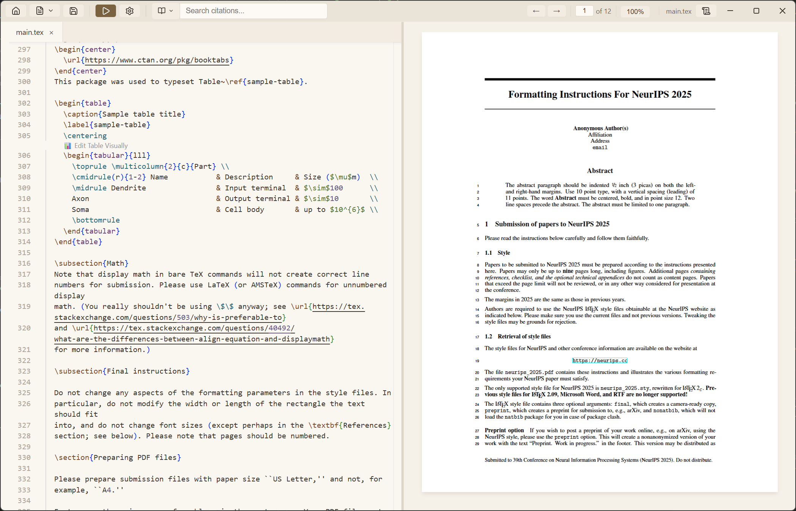
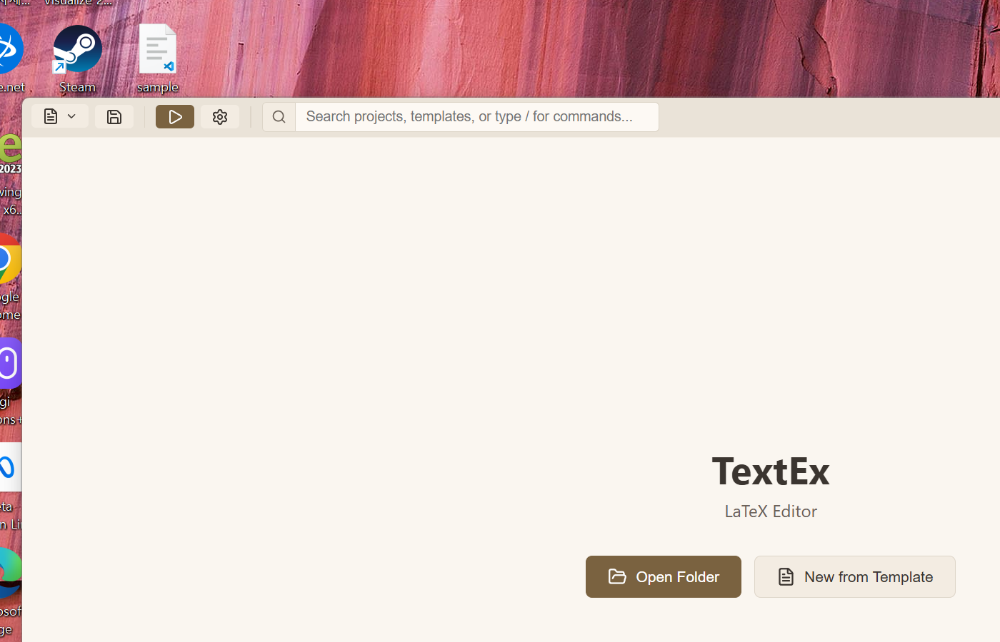
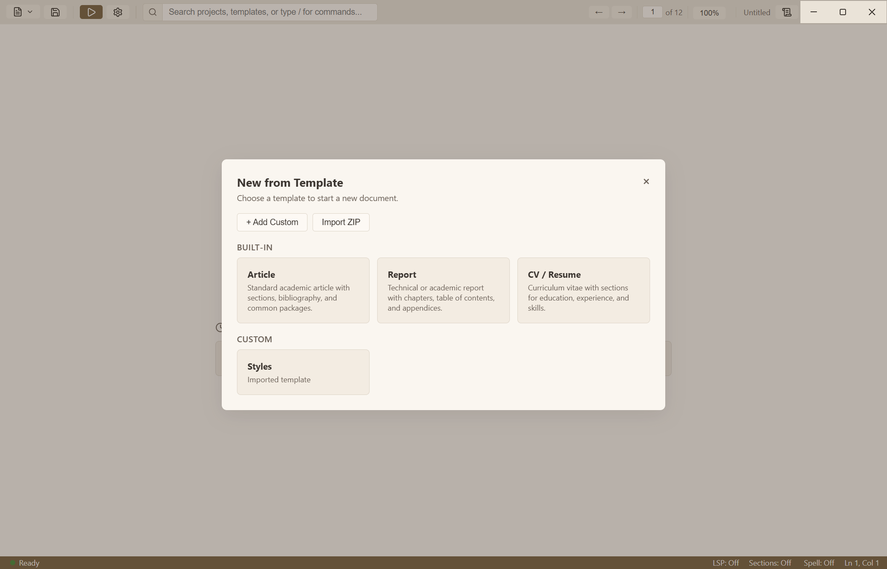
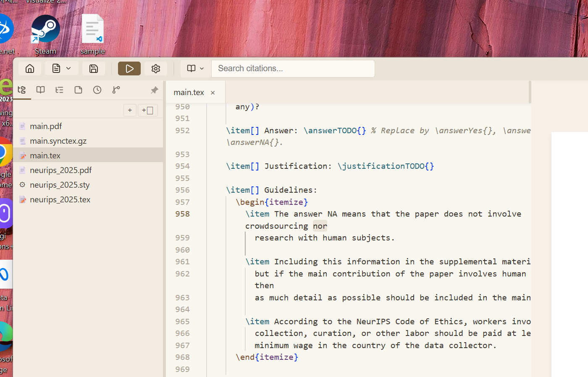
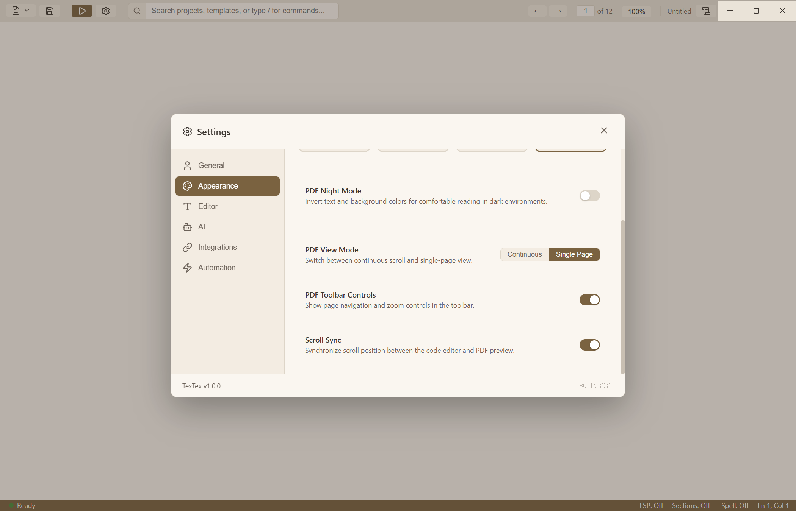
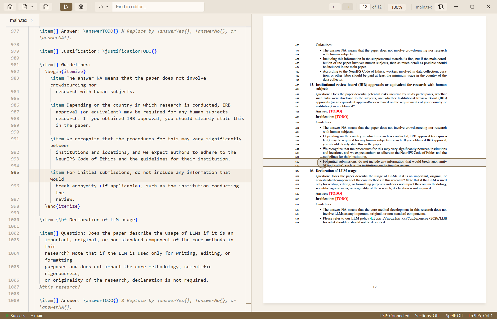
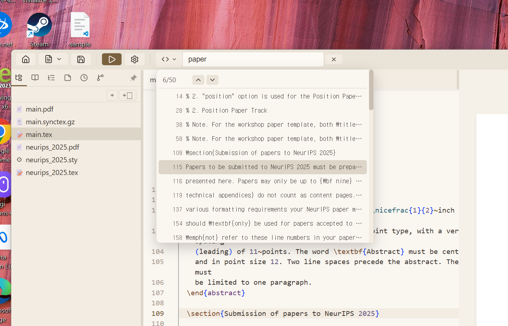

# TextEx

[](https://github.com/Topasm/textex/actions/workflows/build.yml)
[](https://github.com/Topasm/textex/releases/latest)

A **free**, **local-first** desktop LaTeX editor. TextEx runs entirely on your machine — no account, no cloud, no internet required. It provides a split-pane interface with a Monaco code editor on the left and live PDF preview on the right, with a bundled [Tectonic](https://tectonic-typesetting.github.io/) engine so you **do not** need to install TeX Live, MiKTeX, or any other TeX distribution.

<p align="center">
  
</p>

## Key Features

| Feature | Description |
|---------|-------------|
| **Free & Local-First** | No account, no cloud, no internet — your documents stay on your machine |
| **Zero Setup** | Bundled Tectonic engine — no TeX installation required |
| **Live PDF Preview** | Auto-compile on save with instant split-pane preview |
| **Scroll Sync** | Bidirectional scroll synchronization between editor and PDF |
| **SyncTeX** | Ctrl+Click to jump between source code and PDF positions |
| **OmniSearch** | Unified search across citations, PDF content, and editor text |
| **Monaco Editor** | Syntax highlighting, auto-completion, snippets, Vim mode |
| **Multi-File Projects** | Sidebar file tree, tab bar, `\input`/`\include` navigation |
| **Citations** | BibTeX auto-complete + Zotero integration |
| **AI Assistant** | Generate LaTeX from notes, fix grammar, rewrite academically |
| **Git Integration** | Built-in staging, commits, diffs, and branch info |
| **Export** | Convert to Word, HTML, and Markdown via Pandoc |
| **7 Languages** | EN, KO, ES, FR, DE, PT, ZH |

---

## Getting Started

<p align="center">
  
</p>

### 1. Download & Install

Grab the latest release from the [Releases page](https://github.com/Topasm/textex/releases/latest) or from [GitHub Actions](../../actions/workflows/build.yml) for development builds.

| Platform | File |
|----------|------|
| Windows x64 | `.exe` installer |
| macOS Intel | `.dmg` |
| macOS Apple Silicon | `.dmg` |
| Linux x64 | `.AppImage` |

### 2. OS-Specific Setup

**macOS:**
Apps may be quarantined. After installing, run:
```bash
xattr -cr /Applications/TextEx.app
```
Or right-click the app > **Open** > **Open** in Gatekeeper.

**Linux:**
Make the AppImage executable:
```bash
chmod +x TextEx-1.0.0.AppImage
./TextEx-1.0.0.AppImage
```

---

## User Guide

### Creating a New Project
- **Open Folder**: Click the file menu > **Open Folder** to select a directory for your project.
- **Use Templates**: Use **New from Template** to start quickly with a pre-configured LaTeX template (article, beamer, thesis, letter, and more).

<p align="center">
  
</p>

### Multi-File Projects

Open any folder to get a full project view with sidebar file tree, tabs, and `\input`/`\include` navigation.

<p align="center">
  
</p>

### Writing Your Document
TextEx features a modern Monaco-based editor with:
- **Syntax Highlighting**: Full LaTeX syntax support with semantic coloring.
- **Auto-Completion**: Intelligent suggestions for commands, environments, labels, and citation keys.
- **Snippets**: Quickly insert common patterns (e.g., `begin`, `figure`, `table`).
- **Math Preview**: Live-rendered math equations as you type inside `$...$` or `\[...\]`.
- **Section Highlight**: Color-coded bands for `\section` headings in the gutter.
- **Visual Table Editor**: Click the CodeLens above any `tabular` to open a visual editor.

### Compiling & Previewing
- **Auto-Compile**: The PDF preview updates automatically when you save (`Ctrl+S`).
- **Manual Compile**: Press `Ctrl+Enter` to force a compilation at any time.
- **PDF View Modes**: Switch between continuous scroll and single-page view in Settings > Appearance.

### Scroll Sync

<p align="center">
  
</p>

Enable **Scroll Sync** in Settings > Appearance to keep the editor and PDF aligned:
- Scrolling in the **editor** automatically scrolls the PDF to the matching content.
- Scrolling in the **PDF** automatically scrolls the editor to the corresponding source line.
- Uses a precomputed SyncTeX line map for instant lookups (no lag).
- Built-in feedback loop prevention — no bouncing or jittering.

### SyncTeX (Click-to-Jump)
- **Code to PDF**: Click the "Sync Code to PDF" toolbar button to highlight the current line in the PDF.
- **PDF to Code**: `Ctrl+Click` anywhere on the PDF to jump to the corresponding source line.

<p align="center">
  
</p>

### Inserting Images (Smart Drop)
- Simply **drag and drop** an image file from your computer directly into the editor.
- TextEx will automatically:
  1. Copy the image to an `images/` folder in your project.
  2. Insert a complete `\begin{figure} ... \end{figure}` snippet.

### Managing Citations
- **BibTeX Support**: TextEx detects `.bib` files and auto-completes `\cite{...}` keys.
- **Citation Tooltips**: Hover over a citation in the PDF preview to see title, author, and year.
- **Zotero Integration**:
  1. Ensure Zotero with Better BibTeX is running.
  2. Press `Ctrl+Shift+Z` to search your Zotero library.
  3. Select a paper to insert its citation key.

### AI Assistant
- Click **AI Draft** in the toolbar or press `Ctrl+Shift+D`.
- Enter your prompt to generate LaTeX content.
- In-editor actions: select text and use Fix Grammar, Academic Rewrite, Summarize, Make Longer/Shorter.
- Supports OpenAI, Anthropic, and Gemini. Configure in Settings > AI.

### Productivity Tools

<p align="center">
  
</p>

- **OmniSearch**: Press `Ctrl+P` to search across files, citations, PDF text, and commands.
- **Todo Panel**: Track writing tasks in the sidebar.
- **Notes Panel**: Quick scratchpad for ideas.
- **Timeline**: View local file history and revert to any previous save.
- **Git Panel**: Stage, commit, and view diffs without leaving the editor.

---

## Keyboard Shortcuts

| Shortcut | Action |
|----------|--------|
| `Ctrl/Cmd + S` | Save |
| `Ctrl/Cmd + Enter` | Compile |
| `Ctrl/Cmd + P` | OmniSearch |
| `Ctrl/Cmd + L` | Toggle log panel |
| `Ctrl/Cmd + B` | Toggle sidebar |
| `Ctrl/Cmd + F` | Find in editor / PDF |
| `Ctrl/Cmd + Shift + Z` | Zotero search |
| `Ctrl/Cmd + Shift + D` | AI Draft |
| `Shift + Alt + F` | Format document |
| `Ctrl/Cmd + 0` | Fit PDF to width |
| `Ctrl/Cmd + 9` | Fit PDF to height |

---

## Documentation

- [Development Guide](docs/DEVELOPMENT.md)
- [Architecture](docs/ARCHITECTURE.md)
- [IPC Specification](docs/IPC_SPEC.md)
- [Settings Reference](docs/SETTINGS.md)
- [Zotero Integration](docs/ZOTERO.md)
- [CLI Reference](docs/CLI.md)
- [MCP Server](docs/MCP.md)

## License

[MIT](LICENSE)
